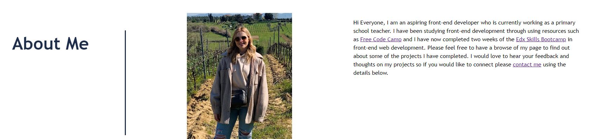
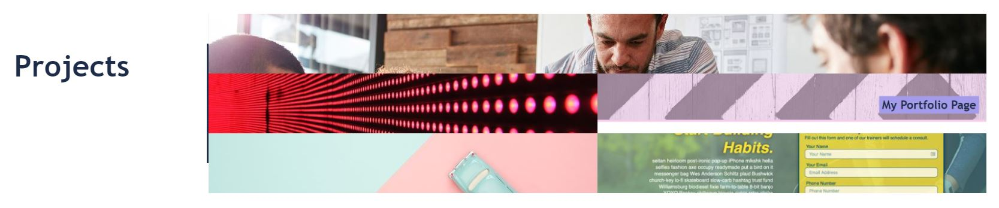
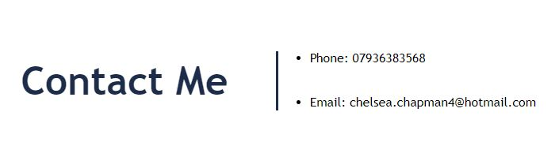

# portfolio-chelsea-chapman
My Project Portfolio

## Description 
This webpage contains some of the most recent projects that I have been working on. The aim was to create a webpage that creates an accessible webpage which clearly shows my projects and allows users to view my projects. Throughout this project, I have developed my understanding of css grids and css flex box. Moving forward, I will add media queries to my page to make it more user friendly on different devices and I will include links and titles to my projects. This task was completed using VS Code. 

https://github.com/chelsea32568/portfolio-chelsea-chapman.git 

## Installation

To work on this code copy this SSH key: git@github.com:chelsea32568/portfolio-chelsea-chapman.git and paste into your desired folder using Git Bash. Then use git pull to pull the file into your local repository. Make necessary changes and then add changes into the git repository by using git add -A, git commit -m "", git push. 

## Usage 
If you click on the 'About Me' 'Projects' and 'Contact Me' links in the nav bar, my page will scroll down to the required area. 

Beneath that, you will find information about myself. 

Visit the portfolio page and take a lot at some of the projects that I have created.   

If you wish to contact me, please use the information at the bottom of the page. 

## Credits

* [Semantic HTML](https://www.w3schools.com/html/html5_semantic_elements.asp)
* [HTMl and CSS knowledge](https://www.freecodecamp.org/learn)

## License
MIT License

Copyright (c) [year] [fullname]

Permission is hereby granted, free of charge, to any person obtaining a copy
of this software and associated documentation files (the "Software"), to deal
in the Software without restriction, including without limitation the rights
to use, copy, modify, merge, publish, distribute, sublicense, and/or sell
copies of the Software, and to permit persons to whom the Software is
furnished to do so, subject to the following conditions:

The above copyright notice and this permission notice shall be included in all
copies or substantial portions of the Software.

THE SOFTWARE IS PROVIDED "AS IS", WITHOUT WARRANTY OF ANY KIND, EXPRESS OR
IMPLIED, INCLUDING BUT NOT LIMITED TO THE WARRANTIES OF MERCHANTABILITY,
FITNESS FOR A PARTICULAR PURPOSE AND NONINFRINGEMENT. IN NO EVENT SHALL THE
AUTHORS OR COPYRIGHT HOLDERS BE LIABLE FOR ANY CLAIM, DAMAGES OR OTHER
LIABILITY, WHETHER IN AN ACTION OF CONTRACT, TORT OR OTHERWISE, ARISING FROM,
OUT OF OR IN CONNECTION WITH THE SOFTWARE OR THE USE OR OTHER DEALINGS IN THE
SOFTWARE.

© 2023 edX Boot Camps LLC. Confidential and Proprietary. All Rights Reserved.

